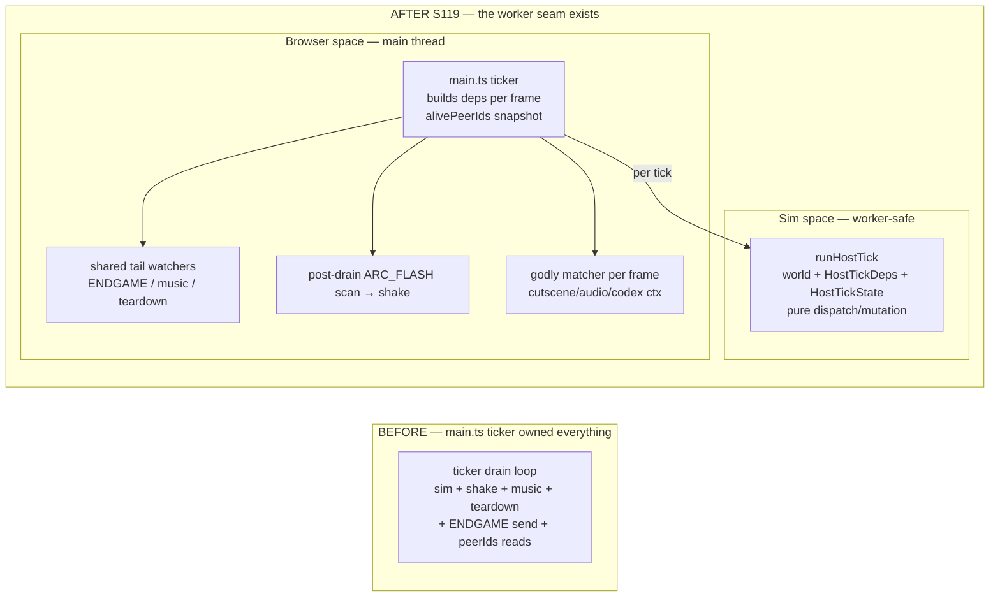

# Worker-Sim Smoothness Milestone — Foundation & Cutover Plan

**Status:** Foundation laid (S107 P2). **Phase (a) runHostTick extraction SHIPPED (S119 P1).** Cutover carried forward (multi-session).
**Goal (owner, S105):** "smooth regardless of who hosts; best + scalable for future real players." Move the authoritative sim behind a **Web Worker** boundary so the host becomes render-only (== a client), and that worker boundary doubles as the future **dedicated-server** boundary.

---

## Why (the problem)
The HOST runs the full Verlet sim on the render thread: `stepPhysics(world, spawner, grid, controls)` at [main.ts:1056](src/main.ts) (host-only, `!isClient`-gated), plus per-tick polls (scoring, game-state, NONET sweep, creature/bomb/spawner/defender), then serializes the **whole world** to JSON every ~100 ms ([main.ts:831](src/main.ts) → `snapshot()` in [save.ts](src/state/save.ts)) and sends at 10 Hz. The snapshot allocates **15+ array spreads per call** (`save.ts` ~614–714: freeSparks, primitives, bonds, players, creatures, bombs, hunters, potatoes, rainbows, seagulls, poops, fouledPrimitives, effects, creatureSpawners, defenders). As the S100–S104 tower-defense entities grew, the host's per-frame cost rose → host FPS drops → "Player One lags, Player Two is smooth" (S105 field report).

---

## Determinism audit (S107 P2) — IS the sim safe to move to a worker?

**Verdict: YES within a single browser. The cutover blockers are ENGINEERING, not determinism.** Evidence:

1. **Replay-determinism is now PROVEN at the physics-loop level.** Before S107, every determinism gate drove the *reducer* (dispatch) path; none drove `stepPhysics` directly — yet the Verlet integrator + bond solver + collision grid (the part a worker runs) is exactly where non-determinism would hide. S107 P2 added `runStepPhysicsStress` ([save.replay.test.ts](src/state/save.replay.test.ts) "S107 P2 stepPhysics physics-loop (HARD GATE)"): two same-seed runs over 300 `stepPhysics` ticks are **byte-identical** (full snapshot JSON) **and** equal under `hashWorldState`. This LOCKS current physics-loop output — the prerequisite the backlog named ("needs a NEW stepPhysics replay test FIRST") for any collision-grid rebuild or worker move.

2. **Transcendental usage** (grep-confirmed): `Math.sqrt` ([collision.ts:30], [bonds.ts:67]), `Math.cos/sin` ([creatureVerlet.ts:155-156]), `Math.hypot` ([creatureVerlet.ts:134,182,202]). `sqrt`/`hypot` are IEEE-754-mandated to a correctly-rounded result → identical on any conformant engine. `sin`/`cos` are **NOT** spec-pinned to a specific result — but a Web Worker shares the **same V8 isolate semantics** as its parent page, so within one browser they are identical. The ONLY divergence risk is a FUTURE dedicated server on a *different* V8 version (or a non-V8 runtime). → milestone risk, not a today problem; if it bites, swap `sin/cos` for a fixed-point/lookup-table or fdlibm-pinned impl.

3. **Float accumulation order** is deterministic: `solveBonds` iterates `Array.from(world.bonds.values())` (Map insertion order, stable), the collision pass iterates the grid in fixed cell order, and the 8-substep loop order is fixed. No `Math.random`/`Date.now`/`performance.now` in the sim. The replay gate (#1) empirically confirms the accumulation is reproducible.

4. **Iteration order** is deterministic: every sim collection is a `Map`/`Set` (insertion-order-preserving in JS), ids are allocated sequentially + host-authoritative, so insertion order is reproducible. `hashWorldState` additionally **sorts by id** before hashing, so the cross-check oracle is robust even to a future reordering of allocation paths.

**Cross-check primitive:** [stateHash.ts](src/state/stateHash.ts) `hashWorldState(world)` — a pure FNV-1a 32-bit fingerprint of `{tick, scoreProgress, scoreByPlayer, primitives, bonds, freeSparks}`, sorted by id. When the cutover lands, host/worker/client each hash their world and compare one u32 per tick (e.g. behind `?DEBUG_HASH=1`) to catch a silent desync without shipping full JSON. **Not on the wire yet** (no consumer this session — premature to serialize).

---

## The blocker the PRIME-AUDIT caught (worker-feasibility) — RESOLVED S119, claim CORRECTED
The S107 scoping workflow's WORKER-FEASIBILITY lens claimed "`state/` has zero render imports → worker-safe." **FALSE** (Opus PRIME-AUDIT): [`state/godlyOrchestration.ts`](src/state/godlyOrchestration.ts) imports `../render/{cutsceneOverlay, audioManager, codexStore, cinematicVignette, debugOverlay}`.

**S119 A.0 correction:** the follow-on claim "so the host *tick* is entangled with godlyOrchestration" was **stale** — a fresh audit showed `runGodlyMatcher` runs **per-FRAME, OUTSIDE the drain loop** (main.ts render section, so it can scan `world.effects` before effectsRenderer wipes). The render side-effects actually inside the tick loop were only: `screenShake.trigger` at creature attack-fire, the shared PLAYING/TITLE edge watchers, the ENDGAME transport send, and a per-tick `netTransport.peerIds()` read. All four were resolved in phase (a) without any intents mechanism (see below).

## Phase (a) — SHIPPED S119 P1 (`src/state/hostTick.ts`)

The entire host per-tick body (stepPhysics → scoring → gameState → NONET sweep → hazard/creature/tower polls → bots → DROP-BENCH → DEV invariants, ~640 LOC) moved verbatim into **`runHostTick(world, deps, state)`** — a DOM/Pixi-free unit. Resolutions:
- **screenShake** → post-drain ARC_FLASH effects-scan in main.ts (the client's S31 pattern; render-identical: nothing renders mid-drain + `ScreenShake.trigger` replaces, never stacks).
- **Shared edge watchers (music/teardown) + ENDGAME send** → stayed verbatim in main.ts's loop tail — they run for BOTH host and client, so they are main-thread orchestration, not host sim (S119 Council R2; an R1 events-based design was rejected because it would have broken the client's watchers).
- **peerIds() per tick** → `deps.alivePeerIds` computed once per frame (single-threaded JS ⇒ equivalent; empirically re-verified per-tick-vs-per-frame in the differential gate).
- **Closure state** → explicit `HostTickState` struct (worker-serializable, no hidden closures).

**Gates shipped with it:** `hostTick.replay.test.ts` (HARD: two same-seed 1000-tick bot runs byte-identical) + `hostTick.differential.test.ts` (frozen verbatim pre-refactor reference @840f31f run side-by-side, per-tick hash equality across 8 forced-state scenarios: solo physics, live bots, voltkin/chewer/drone, all four hazards, spawner+defender teardown, hunter, WIN→POSTGAME, DROP-BENCH).

### Godly-matcher per-frame contract (MUST hold until its phase-d migration)
`runGodlyMatcher` + `startCinematicIfNeeded` (both world-mutating on the host) run once per RENDER FRAME, not per tick:
1. **Cadence cap:** at most ONE godly trigger per frame (the matcher `break`s after a match) — moving it per-tick would raise the cap to one per tick and change gameplay.
2. **Ordering:** it must observe `world.effects` AFTER the drain loop and BEFORE effectsRenderer wipes them each frame.
3. **Side-effect ctx:** it consumes a render ctx (cutsceneOverlay, vignette, debug probes, `unlockGodly` localStorage, `playOneShot` audio). For phase (d) these become worker→main intents, and the cadence contract (1) must be preserved explicitly in the message protocol (e.g. the worker matcher runs once per snapshot batch, not per tick).

---

## Carry-forward — sequenced cutover plan (each its own session/PDR)

| Phase | Work | Blocker / prereq | Risk |
|---|---|---|---|
| **(done) d-1** | `stepPhysics` replay-determinism HARD gate + `hashWorldState` oracle | — | shipped S107 P2 |
| **(done) a** | `runHostTick` extraction — the host per-tick body in a DOM/Pixi-free unit (`state/hostTick.ts`) + replay HARD gate + frozen-reference differential | — | shipped S119 P1 (godly matcher deliberately stays per-frame main-thread — see its contract above) |
| **b** | Snapshot **pooling + delta-encode** (the real O(world)/100 ms fix) | **MEASURED S120 P1 → NO-GO (see "Phase (b) measurement" below).** The 15-spread claim is REFUTED: build is 0.06–0.08 ms avg (0.35 ms under 6× CPU throttle) — send costs 3–6× more, and both are ≪1 frame at 10 Hz. Phase (b) CLOSED-BY-MEASUREMENT; re-measure with a TD-heavy world before the phase-(d) serialization-ROI call (the probe + `e2e/perf-snapshot.spec.ts` remain the instrument) | ~~MED~~ CLOSED |
| **c** | Collision grid 64→8 cell rebuild | the d-1 gate (done) locks behaviour; add an 8-bit cellKey overflow compile-assert (`CANVAS/cell < 256`) | LOW (gated by the gate) |
| **d** | `?worker=1` flag-gated cutover (default OFF): worker entrypoint (sim modules only) + host↔worker message protocol (intents in, snapshots out) + `hashWorldState` cross-check | phases a+b+c; serialization-cost ROI measured (clone+postMessage vs current) | HIGH — ship behind a flag, never default-on until the cross-check is green on real devices |

**Future dedicated-server boundary (beyond the worker):** the same message protocol; the `sin/cos` cross-V8 risk (audit #2) becomes real there — mitigate with a pinned transcendental impl.

---

## Phase (b) measurement — S120 P1 (repeatable protocol + results)

**Instrument:** `SPARK_PERF=1 npx playwright test e2e/perf-snapshot.spec.ts` — forms a REAL
2-peer Trystero duel (host + joiner contexts), builds mid-game state, then reads the S119 P2
`__SPARK__.snapshotProbe` aggregate on the host across three windows; W3 applies **real 6×
CPU throttling** via CDP `Emulation.setCPUThrottlingRate` (the weak-host proxy Grok demanded
in the S120 Council — measured, not analytically multiplied).

**Results (2026-07-10, dev machine, headless Chromium/swiftshader):**

| window | dur | sends | buildAvg ms | buildMax ms | sendAvg ms | sendMax ms | sparks/prims/bonds/creat/haz/fx | snapBytes |
|---|---|---|---|---|---|---|---|---|
| W1 light | 45s | 407 | 0.079 | 0.300 | 0.253 | 0.600 | 27/0/0/0/10/0 | 6657 |
| W2 heavy | 60s | 555 | 0.056 | 0.200 | 0.245 | 0.500 | 26/4/0/0/19/0 | 8549 |
| W3 heavy+6× | 60s | 398 | 0.345 | 0.900 | 1.924 | 3.500 | 22/4/0/0/14/0 | 7333 |

**Verdict: NO-GO** (GO rule was: W2 avg≥0.25 ∨ max≥2, OR W3 avg≥1.5 ∨ max≥12 — no clause fired).
- The "15-spread build dominates" hypothesis is **refuted**: SEND costs 3–6× BUILD in every window.
- Even on the 6× weak-host proxy, build+send ≈ 2.3 ms per send at 10 Hz ≈ **2.3% of CPU** — not the S105 lag source. The weak-host gap lives in **sim+render**, which phases (c)+(d) address.
- **GC blind spot** (perf.mark sees only synchronous time): allocation volume is ~8.5 KB × 15 spreads at 10 Hz — trivial young-gen churn; not NEAR-MISS class.
- **Composition caveat:** the automated build phase landed only 4 prims / 0 creatures (drag
  automation vs live physics). A TD-endgame world is plausibly ~4× snapshot size → still under
  every threshold (W3 avg ≈1.4 ms extrapolated), but **re-run this spec against a TD-heavy world
  before committing to the phase-(d) snapshot serialization design** (which replaces this JSON
  path anyway — transferable ArrayBuffers are the Council-logged candidate).

---

## What S107 P2 delivered (the safe, high-value foundation)
- `stepPhysics` physics-loop replay-determinism HARD gate (the named prerequisite).
- `hashWorldState` pure cross-check oracle + tests (deterministic, sensitive, order-invariant).
- This audit: determinism is worker-SAFE within a browser; the cutover blockers are engineering (render-coupling untangle, measured pooling ROI, message protocol), now documented + sequenced.

Deliberately NOT shipped (would be risky or premature in a 4-item batch — see the S107 scope workflow's unanimous "groundwork-only" verdict): the runHostTick refactor, pooling/delta-encode, the grid rebuild, and the worker cutover.
