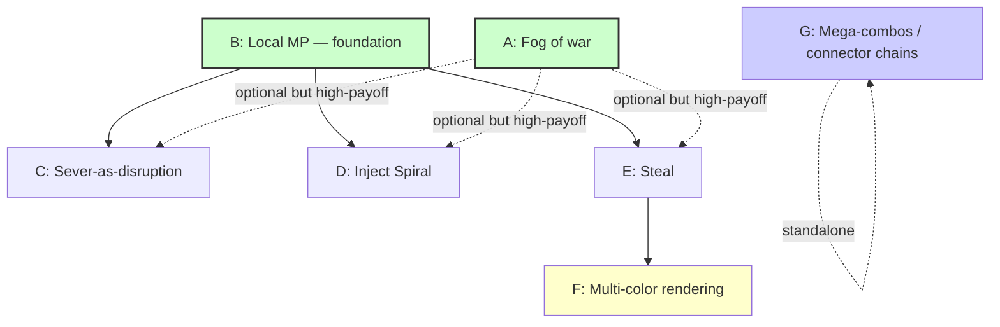

# Phase 2 — Design Options

**Status:** S11 P2 brainstorm. Design-only — no code commits from this doc.
**Trigger:** Pre-emptive prep for the Phase 2 conversation when user signs off Phase 1. Same pattern as S9 P4's [`structure-cinematics-options.md`](structure-cinematics-options.md), which seeded S10's implementation pick.
**Decision target:** S12+ implementation order when user says "ship Phase 2."

---

## Current state (post-S10)

Phase 1 prototype ships solo (`P1` only) with all 36 combos resolving, complexity-weighted scoring (S9 P3, WIN at 50), cross-structure auto-merge (S9 P2), four bond-level cinematics (S10 P2-P4), AttractDrag follow-tuning (S10 P1), full save/load, 179 tests, typecheck clean. The architecture seams documented in `LOCKED_DECISIONS § 10` (`ownerColor`, `lastOwnershipChange`, `lastSeenBy`, `visionMaskFor`, dispatch as single seam) were already plumbed during S2-S4 — Phase 2 plugs into them, no rewrite needed.

What Phase 2 adds (per spec `§ XIII`): multiplayer (1-6 players in spec § II), fog of war (`§ III.4`), the full 3-action disruption mechanic (`§ VIII.3` — Sever / Inject Spiral / Steal), multi-color structures (`§ VI.4`, `§ X.2`), and mega-combos via connector chains (`§ VI.3`).

---

## Rationale: why these 7 mechanics

Source list = spec `§ XIII Phase 2` deliverables ∪ `LOCKED_DECISIONS Phase 2` items ∪ `§ VIII.3` disruption table.

The original PDR enumerated 6 (Fog, Local-MP, Inject Spiral, Steal, Multi-color, Mega-combos). **Council R1 audit against `§ VIII.3` surfaced a 7th: Sever-as-disruption** — Phase 1 already has *self-sever* (`§ VIII.4`), but the cross-player charge-gated attack form is a distinct Phase 2 mechanic and the third row of the `§ VIII.3` disruption table. Including it for spec faithfulness.

**Excluded from this matrix** (mentioned in spec but out of Phase 2 scope or already handled):
- **Networking** (`Phase 3` per BACKLOG).
- **Victory cinematic with full migration + collapse** (`§ III.7` — `Phase 3` per BACKLOG).
- **Energy as resource sink** (`§ VII.2` — Phase 1 has a stub gauge; full formula is `OPEN` per `§ VII.1`, treat as tuning, not Phase 2 mechanic).
- **Primitive decay** (Grok-surfaced 8th candidate — not in spec § XIII; see Open Question #5).

---

## Cross-option layer

### Prerequisites graph



Foundation tier (green) = B (Local-MP) + A (Fog). B is hard-required for C/D/E; A is soft-required for the *strategic payoff* of C/D/E (visibility-gated raiding per `§ VIII.3`).

### Tier groupings

| Tier | Mechanics | Why grouped |
|---|---|---|
| **Foundation** | B, A | Everything else needs these (B hard, A soft). |
| **Disruption suite** (`§ VIII`) | C, D, E | Coupled feature set per `§ VIII.3` table. Charge accumulator + targeting + visibility gate are shared. |
| **Render layer** | F | Activated by E; cheap once E lands. |
| **Richness** | G | Stand-alone — doesn't require any other Phase 2 mechanic. |

### Cost anchors (S1-S10 reference points, live LOC)

| Existing module | LOC | Tier |
|---|---|---|
| `world.ts` | 481 | M (single dispatch + 9 actions + topology + S10 cinematics emissions) |
| `effectsRenderer.ts` | 569 | M⁺ (per-kind draw + lifetime per kind + S10 STRUCTURE_GROW/MERGE/SCORE_TIER) |
| `controls.ts` | 425 | M (FSM + pointer capture + AttractDrag lerp) |
| `bondVisualRenderer.ts` | 397 | M (12 magic silhouettes dispatch) |
| `structure.ts` | 188 | S (BFS / hopMap / sever topology) |
| `combos.ts` | 172 | S (36-combo lookup table) |

**S = <100, M = 100-300, L = 300-500** per anti-bloat charter `§ XV`. Note: `effectsRenderer.ts` at 569 is over the 500-LOC soft charter — flagged as carry-forward for S12+ (likely candidate for per-kind split into 3 files when Phase 2 adds more effect kinds).

---

## Options

### A — Fog of war (`§ III.4`, `§ X.4`)

#### Mechanic in play
```
   ░░░░░░░░░░░░░░░░░░░░░░░░░░░░░░░░░░░░░░░░░░░░░░░░░░░
   ░░░░░░░░░░░░░ ◯ R_personal=300px ░░░░░░░░░░░░░░░░░
   ░░░░░░░░░░░  ╱       ╲          ░░░░░░░░░░░░░░░░░░
   ░░░░░░░░░░░ │  ▲ player  │      ░░░░ ◯ R_beacon=80px
   ░░░░░░░░░░░  ╲       ╱          ░░░░░  ●─●─●  ░░░░
   ░░░░░░░░░░░░░░░░░░░░░░░░░░░░░░░░░░░░░░░░░░░░░░░░░░░░
   ░░░░ memory-fog (dim, desat)  ▲ active vision  ● own structure
```

#### Fires-when / works-how
Per-frame render filter applied after `structureRenderer.sync`. Active vision = union of `R_personal` around own spark + `R_beacon` around each own structure. Memory-fog = anything ever observed retained in dimmed/desat state (`§ X.4`). Never-observed = solid black.

#### Spec authority
`§ III.4` (LOCKED), `§ X.4` (LOCKED), `LOCKED_DECISIONS § 2` items 4-7 (300/80/40 px placeholders), `§ 10.3` render seam (`applyVisionMask(world.visionMaskFor(viewerId), viewport)` pre-plumbed).

#### Implementation cost: **M (200-300 LOC)**
- New `src/render/visionMaskRenderer.ts` (~150 LOC) — radial gradients for personal + beacon, memory-fog opacity curve from `LOCKED_DECISIONS § 2.7` (linear 1.0→0.4, desat 0→0.7 over 30s).
- `world.lastSeenBy: Map<PrimitiveId, Set<PlayerId>>` activation (~20 LOC; seam already noted in `§ 10.3`).
- Render pipeline tap post-structureRenderer (~30 LOC in `main.ts`).
- Tests (~50 LOC) — radius arithmetic, memory-fog opacity curve, observed-by-set membership.
- Anchor: visionMaskRenderer ≈ effectsRenderer × 0.4 (no per-effect logic, just radial blendmodes).

#### Pros
- Highest leverage option — every other mechanic's strategic payoff multiplies under fog (scouting cost, hidden bases, info asymmetry per `§ III.4`).
- Seam pre-plumbed — `viewerId` parameter already threaded.
- Single rendering rule produces enormous design payoff (`§ III.4` justification).

#### Cons
- Solo Phase-1 has no opponents — fog's value compounds with B (MP).
- 300px radius interacts with canvas size (currently 1920×1080) — tuning required against scout cost (`§ VIII.6`).

#### Risks
- **Render perf:** per-pixel mask is expensive at 1920×1080; mitigation = Pixi `Mask` or blendmode-based radial gradient.
- **Memory-fog persistence:** single-game scope OR restart-clear? Spec doesn't say. Implementation choice = single-game by default (matches StarCraft).

#### Playtest readiness
**Smallest playable test:** Solo with all-fog except spark + own-structure beacons. Validates the rendering primitive and navigation feel. ~30-min build cycle pre-MP.

#### Verdict
Foundation-tier mechanic. Highest content-gate of the matrix.

**Flag-for-veto:** Could ship Phase 2 *minimal* with FULL vision (no fog), trading strategic depth for ~250 LOC saved. Less rich; but viable as v1 if user wants quickest path.

---

### B — Local multiplayer (`§ V`, `§ XIII`, `LOCKED_DECISIONS § 10`)

#### Mechanic in play
```
   ┌─────────────────────────────────────────────────────┐
   │  P1 (red)                          P2 (cyan)        │
   │  ●●●●─●                                ●●●●●        │
   │   ●                                     ●           │
   │                  ╱─SPAWNER─╲                        │
   │                 │     ●     │                       │
   │                 │  ●  ●  ●  │                       │
   │                  ╲    ●    ╱                        │
   │                                                     │
   │  P3 (green)                       P4 (orange)       │
   │  ●─●─●─●                              ●●●           │
   └─────────────────────────────────────────────────────┘
```

#### Fires-when / works-how
Foundation — splits `World` into per-player state, plumbs `placerColor` → `ownerColor` distinction through all primitives/bonds/disruption events.

#### Spec authority
Multi-player implied throughout `§ II` (1-6 players), `§ V` mechanics, `§ XI.8` spawner traffic. `LOCKED_DECISIONS § 10` architecture seams ("Phase 1 must store the right state from day 1 so Phase 2/3 plug in without rewrite").

#### Implementation cost: **L (300-500 LOC)**
- World schema split: `players: Map<PlayerId, PlayerState>` (currently Player is singleton): ~80 LOC.
- `ownerColor` plumbed through dispatch (already declared in `§ 10.2`; needs activation): ~30 LOC.
- Spawner becomes shared resource: simultaneous-pickup race resolution: ~50 LOC.
- Per-mode input pipeline (~100 LOC per mode below).
- Tests: ~80 LOC.

#### Sub-options (mutually exclusive — user picks one)
- **B.1 — Split-screen** (~150 LOC): Two halves of canvas, both players see all (incompatible with fog by default), 1 canvas 2 cursors. Cheapest.
- **B.2 — Hotseat** (~100 LOC): Turn-based, single canvas, alternating control. Trivially compatible with fog (each turn has its own viewer).
- **B.3 — Localhost-net** (~400 LOC): Two browser tabs via `BroadcastChannel` or `SharedWorker`. Production-shape; heaviest.

#### Pros
- Unlocks every other Phase 2 mechanic (C-G all require opponent presence to be meaningful).
- Closes a charter promise (`§ II` 1-6 players).
- `§ 10` seams pre-seeded — much architectural work already done.

#### Cons
- 3-way sub-mode decision is upstream gate.
- Networking (B.3) adds infrastructure complexity proportional to ambition.

#### Risks
- **Shared spawner race:** simultaneous LMB-down on same spark → need deterministic resolver (tick-time + player-id tiebreak).
- **B.1 split-screen on small displays** may feel cramped.
- **B.2 hotseat may feel dull** (no parallel pressure).

#### Playtest readiness
**Smallest playable test:** B.2 hotseat at one machine, 2 users, no fog. ~100 LOC stub possible in 1 session. Validates multiplayer feel without MP infrastructure.

#### Verdict
Foundation prerequisite for C-G. **Critical sub-choice:** B.1 vs B.2 vs B.3 — Open Question #1.

**Flag-for-veto:** Could ship Phase 2 minimal as "solo + fog" (A only, no B), validating the rendering primitive without MP. Halves design space; loses raiding entirely (defeats Phase 2 thesis per `§ V`).

---

### C — Sever-as-disruption (`§ VIII.3`, `§ VIII.4`)

#### Mechanic in play
```
   Enemy structure (P1's red), P2 spends 1 charge:
        ●─●─●─●─●─●─●─●
              ║ ← P2 clicks this bond (visibility-gated by fog)
              ▼
   Result (smaller side deletes per § VIII.4):
        ●─●─●     ●─●─●─●─●
        ─DELETE   ─SURVIVE
```

#### Fires-when / works-how
Player spends 1 of ≤2 stored disruption charges (`§ VIII.1-2`). Selects an enemy bond visible to them. Severs per `§ VIII.4` topology rules (smaller side deletes; tiebreaker = latest-built side; sub-edge cases for anchor, connector chains, single-prim).

#### Spec authority
`§ VIII.3` (LOCKED, row 1 of disruption table), `§ VIII.4` (LOCKED — topology rules).

#### Implementation cost: **S (50-150 LOC)**
- `world.severBond` already exists in Phase 1 (self-sever). Cross-player auth gate + charge consumption: ~30 LOC.
- Disruption-charge accumulator (`§ VIII.1` = 1/5 build actions, cap 2): ~50 LOC in `player.ts` + UI in `ui.ts`.
- Targeting UI (click enemy bond; visibility check delegates to A's fog): ~80 LOC.
- Tests: ~30 LOC.
- Anchor: self-sever ~50 LOC in `structure.ts`; cross-player path is a thin authz wrapper.

#### Pros
- Cheapest disruption to ship (~80% code reuse from Phase 1 self-sever).
- Highest impact-per-LOC (one click deletes 5+ primitives per `§ VIII.6` math).
- Spec is fully tight (`§ VIII.4` enumerates every edge case).

#### Cons
- Without D+E, disruption suite feels arbitrary which lone action shipped.
- Targeting under fog requires scouting choreography (`§ VIII.3` visibility gate is hard-required, not soft).

#### Risks
- **Griefing of small structures** (3-prim structure → 1-click delete). Mitigation: `§ VIII.2` cap=2 charges paces it.
- **Charge-accumulator UI clutter** — `§ III.3` says "no HUD numbers"; show as 0/1/2 dots only.

#### Playtest readiness
**Smallest playable test:** Hotseat (B.2), no fog, manual charge-grant, one click severs opponent bond. Validates `§ VIII.6` 1.7× attacker advantage math. ~100 LOC.

#### Verdict
Cheapest member of disruption suite. Ship first.

**Flag-for-veto:** Could skip — Phase 1's self-sever stays, no cross-player. Disruption suite then = D + E only — viable but feels incomplete vs `§ VIII.3`.

---

### D — Inject Spiral (`§ VIII.3`)

#### Mechanic in play
```
   Target structure (P1's red), P2 spends 1 charge:
        ●─●─●─●
        │   │
        ●─●─●─●
   Spiral injected at chosen attachment point:
        ●─●─●─●
        │   │ ╲
        ●─●─●─◇ ← free Spiral primitive (HIGH-tier chaos)
   Chaos modifier propagates strain through neighbors:
        ●─●─●─●
        │   │ ╲
        ●∼●∼●∼◇ ← strain may break adjacent bonds
```

#### Fires-when / works-how
Player spends a charge, picks attachment point on enemy structure. Free Spiral primitive is created (`ownerColor` = attacker), bonded to chosen target prim. Spiral's chaos modifier (HIGH-tier combo influence) increases bond strain in adjacent primitives.

#### Spec authority
`§ VIII.3` (LOCKED, row 2). Chaos propagation rules are **spec-ambiguous** — "often destabilizing neighboring combos" is the spec text. Concrete propagation distance is an Open Question.

#### Implementation cost: **M (150-250 LOC)**
- Spiral primitive type already exists (one of 6).
- Free-Spiral disruption action — create new prim + bond: ~50 LOC.
- Chaos modifier propagation — scale strain in N-hop adjacent bonds: ~80 LOC (touches `physics/bonds.ts` constraint solver).
- Targeting UI: ~50 LOC.
- Tests: ~40 LOC.
- Anchor: combo physics tuning at S3 ~100 LOC.

#### Pros
- Different damage shape vs Sever — lasting destabilization, target must react.
- Reuses Phase-1 Spiral type rendering.
- Forces target into decision tree (sever the Spiral? leave it? rebuild around?).

#### Cons
- **Spec-ambiguous propagation** — must close before implementation (Open Question #3 below).
- Bond physics tuning intensity comparable to S10 cinematics constants.

#### Risks
- **Too-strong propagation** → instant cascading structure collapse, over-punishing.
- **Too-weak propagation** → mechanic feels decorative.
- Requires N-step playtest tuning, not 1-shot.

#### Playtest readiness
**Smallest playable test:** Hotseat (B.2), manual-place Spiral into opponent's 4-prim structure, observe strain propagation over ~30 ticks. ~150 LOC stub. Pure-design risk priority — tune before shipping.

#### Verdict
Highest design-risk option in the matrix (spec-ambiguous propagation). Ship AFTER C — Sever-baseline gives playtester a feel anchor.

**Flag-for-veto:** Could ship disruption with only C + E (skip Spiral). Simpler suite; loses "lasting destabilization" damage shape; Phase 2 minimal still viable.

---

### E — Steal (`§ VIII.3`, `§ VI.4`)

#### Mechanic in play
```
   Target (P1's red):                P2's structure (cyan):
        ●─●─●─●                          ●─●─●
        │ │
        ●─●
   P2 spends 1 charge, detaches one primitive:
        ●─●─●─●                          ●─●─●
        │      ← stolen prim now in P2's carry (overrides 1-carry rule)
        ●─●
   P2 places stolen prim — color flips to attacker on place (§ VI.4):
        ●─●─●─●                          ●─●─●─●  ← stolen prim re-colored cyan
        │                                     │
        ●─●                                   ● (cyan)
```

#### Fires-when / works-how
Player spends a charge, selects a single visible enemy primitive. Bonds to old structure are severed; primitive enters attacker's carry slot (bypassing 1-carry limit for this instance per `§ VIII.3`). On place, `placerColor` flips to attacker (per `§ VI.4`). Old structure may split into multiple components — each evaluated against `§ VIII.4` topology.

#### Spec authority
`§ VIII.3` (LOCKED, row 3), `§ VI.4` color inheritance (LOCKED), `§ 10.2` `ownerColor` mutable on Steal.

#### Implementation cost: **M (200-300 LOC)**
- Detach: remove prim + adjacent bonds; treat post-detach result via `§ VIII.4` topology: ~80 LOC.
- Carry-1 bypass — extends `Player.Carrying` discriminated union: ~30 LOC.
- Color flip on place: ~10 LOC (existing `placerColor` write at `dispatch(PLACE_PRIMITIVE)`).
- Multi-color rendering needed (F) for the now-mixed-ownership target: ~implicit prereq.
- Tests: ~50 LOC including cascade-delete cases.
- Anchor: structure.ts sever logic ~80 LOC; detach has similar shape.

#### Pros
- Most strategically rich disruption — enemy loses AND attacker gains.
- Closes the "raid for value" play loop (`§ VIII.6` math).
- Validates multi-color rendering (F) — couple as a pair.

#### Cons
- Cascade-delete risk: detach may isolate adjacent prims → § VIII.4 applies → unexpected secondary deletions.
- Carry-1 bypass adds an edge case to the type system (`Player.Carrying`).
- Requires F (Multi-color) to visually communicate stolen-prim ownership.

#### Risks
- **Cascade-delete griefing** beyond Sever (e.g., steal-then-cascade pattern).
- **Magic-combo bond preserved on steal?** Spec doesn't say — if target prim had a magic combo with neighbor, does stealing it erase that combo's reward? (Open Question #4).

#### Playtest readiness
**Smallest playable test:** Hotseat (B.2) + manual detach script + F.1 stub (color flip on prim, no gradient). ~200 LOC stub. Validates the play loop; cascade-delete cases need separate scenarios.

#### Verdict
Heaviest disruption to ship; richest payoff. Pair with F. Ship LAST of disruption suite (C → D → E).

**Flag-for-veto:** Could skip Steal entirely. Sever + Inject Spiral suffices for "raiding feel" — but loses the territorial/economic dimension of the game per `§ V`.

---

### F — Multi-color rendering (`§ VI.4`, `§ X.2`, line 510)

#### Mechanic in play
```
   Mixed-ownership structure (post-Steal):
       ●─●─●─●─●
       │ ├─│─│ ← bond gradients between cross-color endpoints
       red red cyan red red
   Bond stroke color = lerp(endpointA.color, endpointB.color, 0.5):
       red ── red ── (red→cyan) ── (cyan→red) ── red
```

#### Fires-when / works-how
Per-frame render of any bond whose endpoint `placerColor`s differ. Gradient stroke from endpoint A to endpoint B.

#### Spec authority
`§ VI.4` color inheritance (LOCKED — "multi-toned"), line 273 "gradient bonds, mixed primitives", line 510 "multi-color gradient structures reveal contributions".

#### Implementation cost: **S (50-100 LOC)**
- `bondVisualRenderer.ts` (400 LOC) gains gradient-stroke logic in `default` line draw + per-silhouette: ~50 LOC.
- `structureRenderer.ts` ownership tally for HUD (optional): ~20 LOC.
- Tests: ~20 LOC (pixel sample at gradient midpoint).
- Anchor: bondVisualRenderer's existing 12-magic dispatch ~150 LOC; gradient mode is a small extension.

#### Pros
- Cheap rendering layer that activates Steal's (E) visual payoff.
- Aesthetic — matches game vision (line 277: "aesthetic beauty as emergent property of multiplayer interaction").
- "Contested zone" visible at a glance (`§ X.2`).

#### Cons
- Only meaningful with E (Steal) + B (Local-MP) — solo has no mixed ownership.
- Per-silhouette gradient may need shader if perf becomes issue (current Pixi `Graphics` approach is fine for ≤50 bonds).

#### Risks
- 12 magic-combo silhouettes (cable/whip/wheel/etc) each need gradient-mode verification — could surface a silhouette that doesn't gradient-stretch cleanly.

#### Playtest readiness
**Smallest playable test:** Manually set adjacent prims' `placerColor` to different colors, observe bond gradient at all 12 silhouettes. ~50 LOC. Stand-alone (no MP needed).

#### Verdict
Cheap rendering layer; couple with Steal (E).

**Flag-for-veto:** Could ship Steal with simple "stolen prim solid-flipped to attacker color" + no bond gradient. Saves ~60 LOC; loses contested-zone visual signal.

---

### G — Mega-combos via connector chain (`§ VI.3`, `LOCKED_DECISIONS § 3.11`)

#### Mechanic in play
```
   Two separate structures, built far apart:
       ●─●─●─●                       ●─●─●─●
       │ │                            │ │
       ●─●                            ●─●

   Player builds a 4-prim connector chain (4 trips):
       ●─●─●─●─●─●─●─●─●─●─●─●
       │ │                            │ │
       ●─●                            ●─●

   Merge fires (S9 P2 cross-structure auto-merge):
   Combined structure earns ×1.5-2.0 area multiplier (§ VI.3 — exact OPEN).
   Chain prims are flagged as bridge — sever cuts erase the smaller side per § VIII.4.
```

#### Fires-when / works-how
A `placePrimitive` causes cross-structure merge (S9 P2's `mergeCandidateIds` path). If the merged graph contains a sub-path of ≥2 primitives forming a bridge between two larger subgraphs, apply mega-combo multiplier to area-claim score.

#### Spec authority
`§ VI.3` mega-combos via connector chain (LOCKED — UPDATED in v0.5), `LOCKED_DECISIONS § 3` item 11 ("Connector chain: min 2 primitives, +1 build-action credit per [PHASE 2]").

#### Implementation cost: **M (100-200 LOC)**
- Bridge detection on merged component (O(V+E) bi-connectivity / articulation-edge check): ~80 LOC in `structure.ts`.
- Area-claim multiplier application — extend `scoreProgress` accumulator (S9 P3) with multiplier-on-mega-combo path: ~30 LOC.
- Vulnerability rendering — highlight bridge prims so player sees the risk: ~30 LOC in `structureRenderer.ts`.
- Tests: ~40 LOC for graph topology cases.
- Anchor: S10 P2's `bfsHopMap` is ~50 LOC; bridge detection is similar O(V+E) graph traversal.

#### Pros
- Strategic depth — rewards spatial planning AND risk-taking (long thin bridges are sever targets per `§ VI.3`).
- Already partly enabled by S9 P2 cross-structure merge (the merge action exists; what's missing is the bonus-on-bridge detection).
- **Stand-alone** — doesn't require any other Phase 2 mechanic. Could ship solo.

#### Cons
- Multiplier value is `OPEN` (`§ VI.3` says 1.5-2.0×; `LOCKED_DECISIONS § 3.10` says 1.75×) — pick from range.
- Vulnerability visualization is a new UX surface.

#### Risks
- **Bridge-detection algorithm subtle** — articulation-edge logic must handle multi-bridge cases (two parallel chains).
- **Multiplier balance:** too high → must-build; too low → not worth chain cost. Playtest tunable.

#### Playtest readiness
**Smallest playable test:** Solo, build two anchor-rooted structures + connector chain, observe ×1.75 score bonus. ~150 LOC. Stand-alone.

#### Verdict
Stand-alone richness add. Doesn't require A/B/C/D/E/F. Good post-foundation polish.

**Flag-for-veto:** Could defer to Phase 3. Phase 2 loses some strategic depth without it.

---

## Open questions for user

1. **Multiplayer sub-mode (B.1 / B.2 / B.3)?** Hotseat is cheapest + most playtest-ready; split-screen is most-shared-experience but incompatible with fog; localhost-net is production-shape but heaviest. Recommend **B.2 hotseat** for first playtest cycle.

2. **Phase 2 minimal vs full?** Minimal = A + B.2 + one disruption action (C) → ~600 LOC, 2 sessions. Full = all 7 → ~1500 LOC, 4-5 sessions. Recommend minimal-first to validate feel before committing to full.

3. **Inject Spiral (D) chaos propagation depth?** Spec is ambiguous (`§ VIII.3` row 2 says "neighboring combos"). Concrete options: 1-hop adjacent only / 2-hop / strain-distance-scaled. **Affects ~80 LOC of bond physics.** Defer to D's implementation session.

4. **Steal (E) preserves magic-combo bonus on stolen prim?** If P1's prim had a Filament combo with neighbor, does stealing it erase that combo's score award retroactively, or only invalidate future contribution? Spec silent. **Recommend: future contribution only** (retroactive score-strip would be too punishing — undoes player work post-hoc).

5. **Primitive decay as 8th mechanic?** Grok-surfaced during Council R1. Not in spec `§ XIII` Phase 2 list. Could be Phase 1.5 balance tuning (against spawner spam) instead. Recommend: **defer to Phase 1.5 tuning** unless user wants it as Phase 2 row.

6. **Sever-as-disruption (C) was missing from the original 6-mechanic PDR list.** Council surfaced it from `§ VIII.3` row 1. Is this a deliberate omission (because Phase 1's self-sever already exists and Steal+Inject Spiral were the "new" disruption actions) or an oversight to correct? **Affects matrix shape (6 vs 7 options).**

7. **Multi-color rendering depth (F)?** Cheap (solid color-flip on stolen prim, no gradient) or rich (per-bond gradient per F)? Saves ~60 LOC at the cost of "contested zone" legibility. Recommend rich version when E ships.

---

## Recommendation: tiered rollout (if "ship Phase 2 minimal")

Estimates anchored to Phase-1 session LOC tempo (~400 LOC / Standard session).

| Tier | Session(s) | Mechanics | LOC | Why this order |
|---|---|---|---|---|
| **0 — Foundation** | S12 | B.2 (Hotseat) + A (Fog) | ~450 | Unblocks every Phase 2 mechanic. Fog without MP still validates the rendering primitive. |
| **1 — Core combat** | S13 | C (Sever-as-disruption) + F (Multi-color render) | ~220 | Cheapest disruption action + cheapest render layer, paired. Closes raiding-feel loop. |
| **2 — Rich combat** | S14 | E (Steal) | ~250 | Couples with F. Closes territorial loop. |
| **3 — Richness** | S15 | D (Inject Spiral) + G (Mega-combos) | ~350 | Spiral last because spec-ambiguous propagation; G is standalone. |

**Estimated total: ~1270 LOC across 4 Standard-tier sessions** — matches Phase 1's tempo (S5-S10 averaged ~450 LOC/session).

**Minimal-minimal alternative**: Tier 0 only (~450 LOC, 1 session). Validates rendering primitive + multiplayer feel without committing to disruption suite. User can then either ship Phase-2-minimal-final or proceed to Tier 1.

---

## Council R1 deliberation summary

**Grok DISRUPTOR** (Verdict: REVISE):
- ✅ Adopted: F tagged Steal-dependent (not standalone) — see prerequisites graph.
- ✅ Adopted: Cost anchors grounded in S1-S10 module LOC (not subjective S/M/L).
- ✅ Adopted: "Risks" subsection per option (separate from Cons).
- ✅ Adopted: Decay as Open Question #5 (not core).
- ❌ Rejected: Prototype branch / Vite-embedded sim / Notion alternatives — violate "no code" PDR constraint + Phase-1 charter forbids out-of-band code stubs.
- ❌ Rejected: Drop G (Mega-combos) — spec citation IS in § VI.3, not § XIII; Grok's challenge was incorrect on this.

**Gemini AUDITOR** (Verdict: REVISE):
- ✅ Adopted: Playtest readiness per option (subsection added).
- ✅ Adopted: Risk subsection per option.
- ✅ Adopted: Rationale paragraph for why these 7 mechanics.
- ✅ Adopted: Mermaid graph for prereqs (renders in GitHub + most MD viewers).
- 📋 Noted: "What if user proposes 7th?" → Open Question #5 (decay) + #6 (Sever-as-disruption inclusion) explicitly invites user pruning/addition.

**Battle Ledger summary:**

| # | Decision | Resolution | Authority |
|---|---|---|---|
| 1 | 6 vs 7 mechanics (add Sever) | **7** — Sever-as-disruption added per `§ VIII.3` row 1 | Spec faithfulness |
| 2 | F standalone vs Steal-derived | **Steal-derived** (prereq edge in graph) | Grok (risk) |
| 3 | Drop G (Mega-combos) | **Keep** — § VI.3 cites it | Claude (impl) |
| 4 | Add decay as 8th | **Open Question only** | Both |
| 5 | Markdown vs interactive | **Markdown + Mermaid** — Mermaid renders in GitHub | Gemini (tool util) |
| 6 | Per-option risk + playtest readiness | **Added** | Gemini (quality) |
| 7 | Cost anchors | **Grounded in S1-S10 LOC** | Grok (logic opt) |

**Council verdict (post-revisions): SHIP.** This doc reflects all adopted Council changes.
